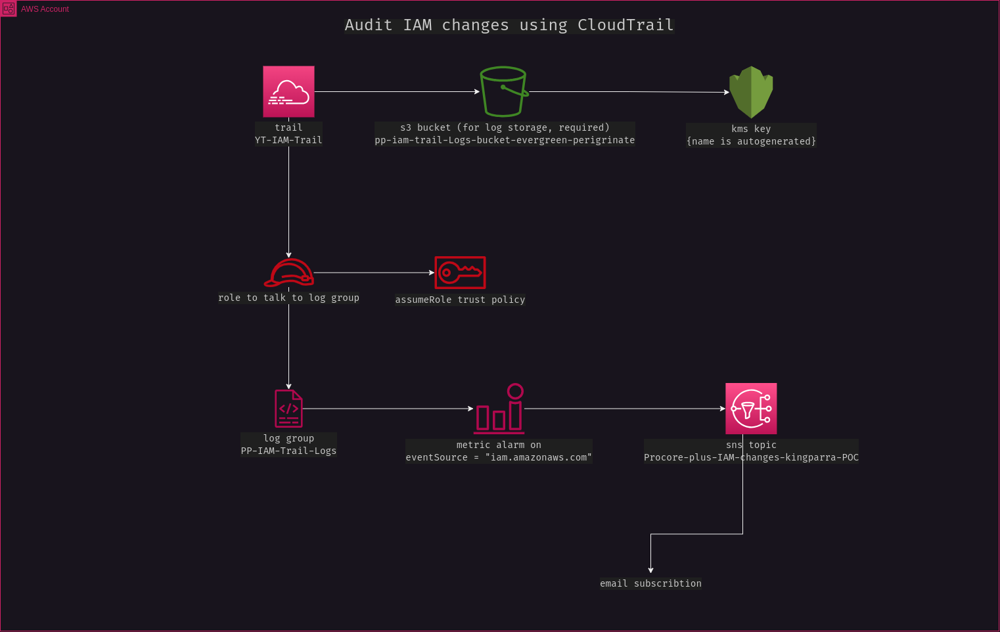

Ticket 6. (Project) Audit solution for IAM changes
**************************************************

* Enable CloudTrail in us-east-1 for the account

* Send trail logs to the CloudWatch "PP-IAM-Trail-Logs" log group

* Create an sns topic called "Procore-plus-IAM-changes-kingparra-POC" and subscribe your email and the company's email "procoreplusmd@gmail.com".

* Create a CloudWatch Alarm and subscribe the sns topic to the alarm. Using the following pattern create a metric alarm that will monitor all the calls & changes to IAM. ``{ ($.eventSource = "iam.amazonaws.com") }``. All calls to IAM will be recorded by the cloudtrail and for each calls you will be notified.

* Test your setup by making an IAM change. Provide a screenshot of the email you received after doing the changes on IAM.