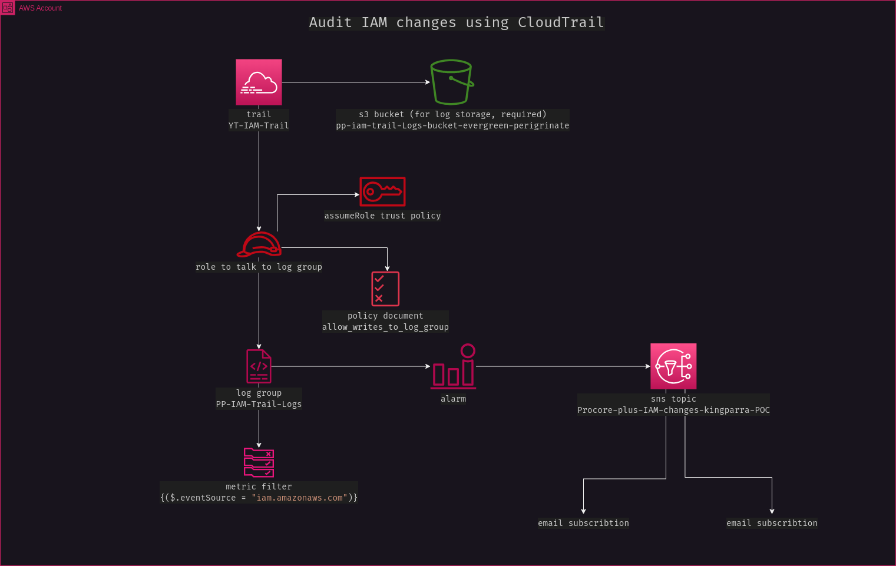

Ticket 6. (Project) Audit solution for IAM changes
**************************************************

The goal of this ticket is to send an email whenever any API actions from the IAM service are logged by CloudWatch.

In order to do that, several resources are involved. Above you can see a diagram of how they relate. The following sections are the sub-tasks of this ticket and their descriptions.

The main solution to this ticket is actually manual. You can download a video of it here: https://drive.proton.me/urls/8YT3N6Z1ZC#V4t35KWydr2i

Create a trail
--------------
Create a trail called "YT-IAM-Trail"

Send all trail logs to CloudWatch
---------------------------------
Send trail logs to the CloudWatch log group "PP-IAM-Trail-Logs".

Create a notification topic
---------------------------
Create an sns topic called "Procore-plus-IAM-changes-kingparra-POC" and subscribe your email and the company's email "procoreplusmd@gmail.com".

Create an alarm
---------------
Create a CloudWatch Alarm and subscribe the sns topic to the alarm. 

Using the following pattern create a metric alarm that will monitor all the calls & changes to IAM. ``{ ($.eventSource = "iam.amazonaws.com") }``.
  
All calls to IAM will be recorded by the cloudtrail and for each calls you will be notified.

Test your setup
---------------
Test your setup by making an IAM change. Provide a screenshot of the email you received after doing the changes on IAM.