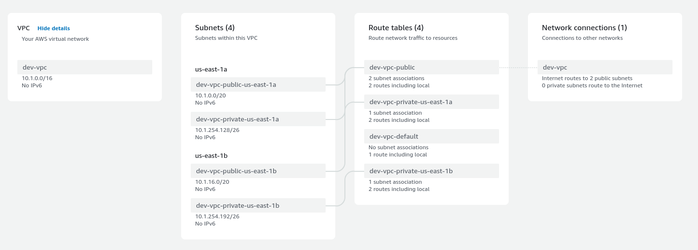
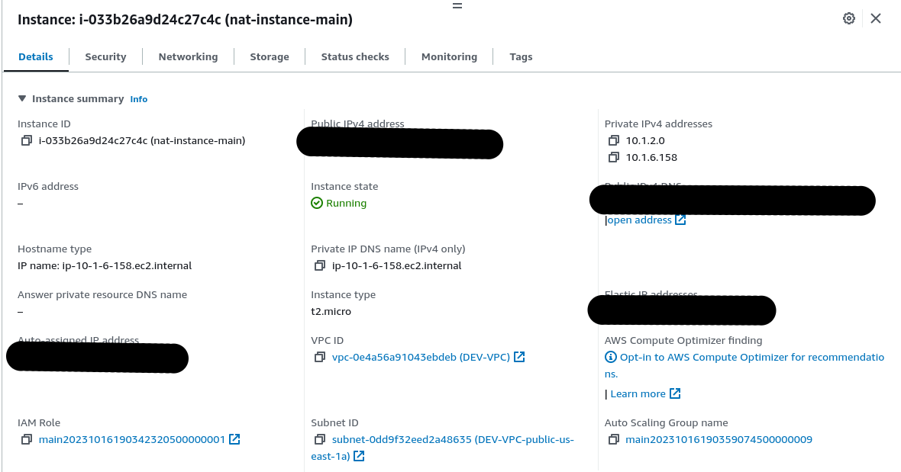
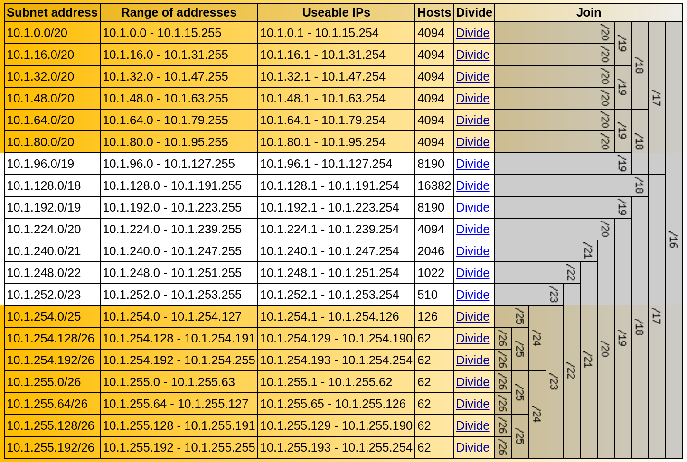

****************************************
 Ticket 7. Create a VPC for development
****************************************

Requirements
------------
Create a development VPC called “DEV-VPC” using the 10.1.0.0/16 IP space. 

* This VPC will be used only for development purposes.
* To keep costs low on this Dev VPC please use a Nat Instance instead of a Nat Gateway. 
* We have been asked to make the public subnets large enough to fit at least 200 hosts and the private subnets should have space for no more than 62 hosts.

Create public subnets
^^^^^^^^^^^^^^^^^^^^^
Create 2 public subnets for the front-end apps and resources.

Create private subnets
^^^^^^^^^^^^^^^^^^^^^^
Create 2 private subnets for any back-end resources.

Add a nat Instance
^^^^^^^^^^^^^^^^^^

Implementation
--------------
Here are the details of the VPC as currently configured.

Here are the instance details:

Here is the subnet layout I came up with. `link <https://www.davidc.net/sites/default/subnets/subnets.html?network=10.1.0.0&mask=16&division=39.f46455d231>`_.

