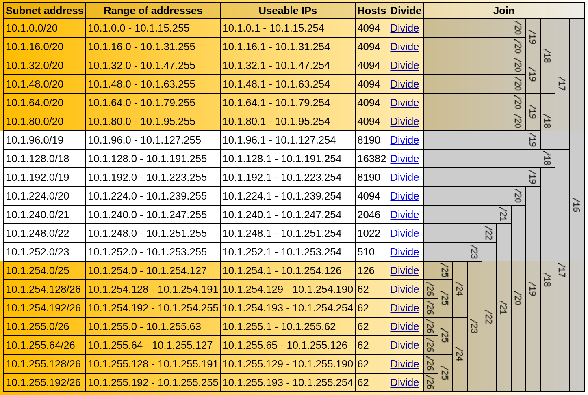

Ticket 7. Create a VPC for development
**************************************
Create a development VPC called “DEV-VPC” using the 10.1.0.0/16 IP space. 

Requirements
------------

* This VPC will be used only for development purposes.

* To keep costs low on this Dev VPC please use a Nat Instance instead of a Nat Gateway. 

* We have been asked to make the public subnets large enough to fit at least 200 hosts and the private subnets should have space for no more than 62 hosts.

Implementation
--------------
Here is the subnet layout I came up with. `link <https://www.davidc.net/sites/default/subnets/subnets.html?network=10.1.0.0&mask=16&division=39.f46455d231>`_.

