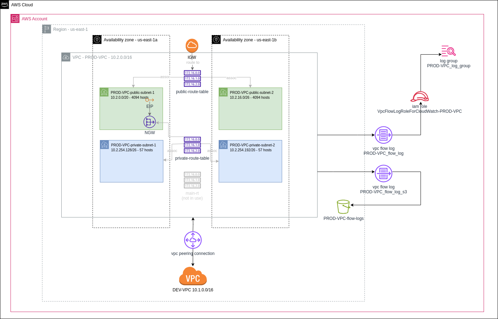

***************************************
 Ticket 8. Create a VPC for production
***************************************

Requirements
------------
* CIDR 10.2.0.0/16 
* Since this is a prod VPC deploy a Nat Gateway. 
* We have been asked to make the public subnets large enough to fit at least 200 hosts and the private subnets should have space for no more than 62 hosts.
* Since this is a production VPC, you need to provide Documentation of the VPC that includes a diagram of the VPC components and has information about CIDR ranges used at the VPC and Subnet level.
* A VPC Peering Connection should be established between the Dev and Prod VPC and logs should be captured from the prod VPC and pushed to CloudWatch and an S3 Bucket.

Create public subnets
^^^^^^^^^^^^^^^^^^^^^
Create 2 public subnets for front-end resources.
Provide screenshots of both subnets details.

Create private subnets
^^^^^^^^^^^^^^^^^^^^^^
Create 2 private subnets for any back-end activity.
Provide screenshots of both subnets details.

Add NAT gateway
^^^^^^^^^^^^^^^
Deploy a Nat Gateway to route traffic from private subnets.
The gateway makes sure that the internet doesn't initiate a connection with the instances.

Create a diagram of the VPC
^^^^^^^^^^^^^^^^^^^^^^^^^^^
Create a Diagram to document the VPC
Add a screenshot of the diagram to the ticket.

Create a VPC peering connection
^^^^^^^^^^^^^^^^^^^^^^^^^^^^^^^
Initiate a VPC peering connection between the Dev and Prod VPCs
This VPC peering connection will allow instances in either VPC to communicate with each other as if they are within the same network.

Enable flow logs
^^^^^^^^^^^^^^^^
Enable VPC Flow logs on the Prod VPC and push data to CloudWatch.
Monitoring network traffic is a critical component of security best practices to meet compliance requirements, investigate security incidents, track key metrics, and configure automated notifications. AWS VPC Flow Logs captures information about the IP traffic going to and from network interfaces in your VPC.

Push flow logs to S3
^^^^^^^^^^^^^^^^^^^^
Enable VPC Flow logs on the Prod VPC and push data to a s3 Bucket called ``Flow-Logs-<AccountNumber>``
Flow log records for all of the monitored network interfaces are published to a series of log file objects that are stored in the bucket.

Implementation
--------------
Architecture diagram

Subnet layout

How to run the code
^^^^^^^^^^^^^^^^^^^
To run the code, first install terraform.

Then configure aws cli with your credentials, for eaxmple ``aws --profile
procore configure``.

To use a non-default profile, export the environment variable
``AWS_PROFILE``. For example ``export AWS_PROFILE=procore`` in
your shell.

Then you can run ``terraform apply -target module.vpc`` to set up the vpc.

Afterwards, run ``terraform apply`` to create the rest of the resources.
