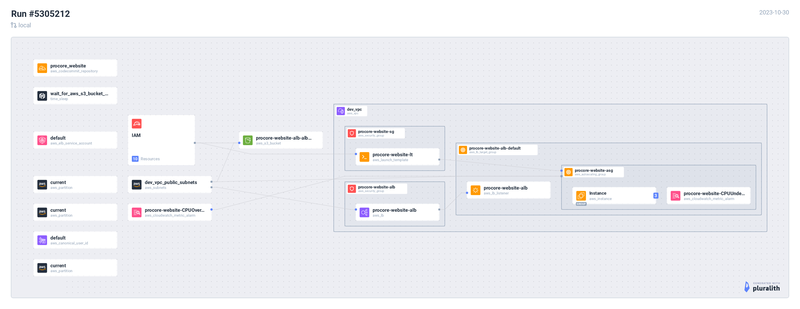

**********************************************
 Ticket 10. Deploy a highly available website
**********************************************

Requirements
------------
* Download the website code from an s3 bucket 
  https://procoreplusproductwebsite.s3.amazonaws.com/procore-website-master.zip
  and create a new Code Commit Repo to host this code.
* Use an Application Load Balancer.
* Autoscale the workload with a launch template

Push website code to codecommit repo from local computer
^^^^^^^^^^^^^^^^^^^^^^^^^^^^^^^^^^^^^^^^^^^^^^^^^^^^^^^^
Create a repo on Codecommit and load the code you downloaded from s3.

Create a launch template and userdata
^^^^^^^^^^^^^^^^^^^^^^^^^^^^^^^^^^^^^
Create a Launch Template for your Autoscaling group to deploy
EC2 instances and also create a userdata script to install the
apache server and to pull the code from codecommit.

Provide a copy of the userdata script and the name of the launch template.

Create an autoscaling group
^^^^^^^^^^^^^^^^^^^^^^^^^^^
Configure an autoscaling group.
Requirements:

* Desired capacity: 2 instances
* Minimum capacity: 1 instance
* Maximum capacity: 3 instances

Autoscaling policy: dynamic scaling policy that will trigger 
if the average cpu utilization is over 70%  and a warmup time 
of 250 seconds .

Create application load balancer adn attach the instances
^^^^^^^^^^^^^^^^^^^^^^^^^^^^^^^^^^^^^^^^^^^^^^^^^^^^^^^^^
Create an Application Load balancer to manage traffic to
your autoscaling group.
Requirements:

* ALB needs to be internet facing.
* Needs to use all public subnets in the DEV VPC.
* Only use IPV4. 

Provide the ALB dns so we can verify that everything is working.

Implementation
--------------

