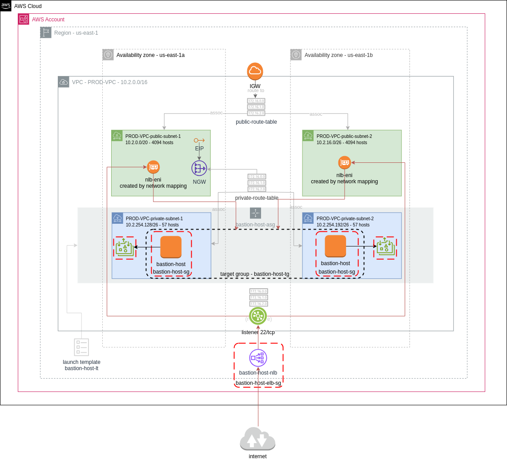

**********************************
 Ticket 12. Create a bastion host
**********************************

Requirements
------------
Procore wants to improve architecture and security of
the Bastion Host used to receive ssh connections from
outside our Prod VPC.

Design Considerations
^^^^^^^^^^^^^^^^^^^^^
* Bastion Instances run in a private subnet
* Bastion Instances are autoscaled in at least 2 subnets
* Bastion receives ssh traffic exclusively through a public facing ELB. 
* Provide ELB DNS name for ssh connection. 
* Home Directories should be mounted from a Elastic
  File System (EFS). Check out this article for
  reference Walkthrough: Create Writable Per-User
  Subdirectories and Configure Automatic Remounting on
  Reboot - Amazon Elastic File System  
* Run in the Production VPC
* Display a login banner

  ::

      * * * * * * * * W A R N I N G * * * * * * * * * *
      This computer system is the property of ProCore
      Plus. It is for authorized use only. By using
      this system, all users acknowledge notice of, and
      agree to comply with, the Acceptable Use of
      Information Technology Resources Policy (“AUP”).
      Unauthorized or improper use of this system may
      result in administrative disciplinary action,
      civil charges/criminal penalties, and/or other
      sanctions as set forth in the AUP. By continuing
      to use this system you indicate your awareness of
      and consent to these terms and conditions of use.
      LOG OFF IMMEDIATELY if you do not agree to the
      conditions stated in this warning. 
      * * * * * * * * * * * * * * * * * * * * * * * * *

Implementation
--------------

